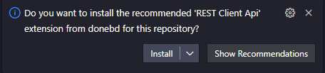
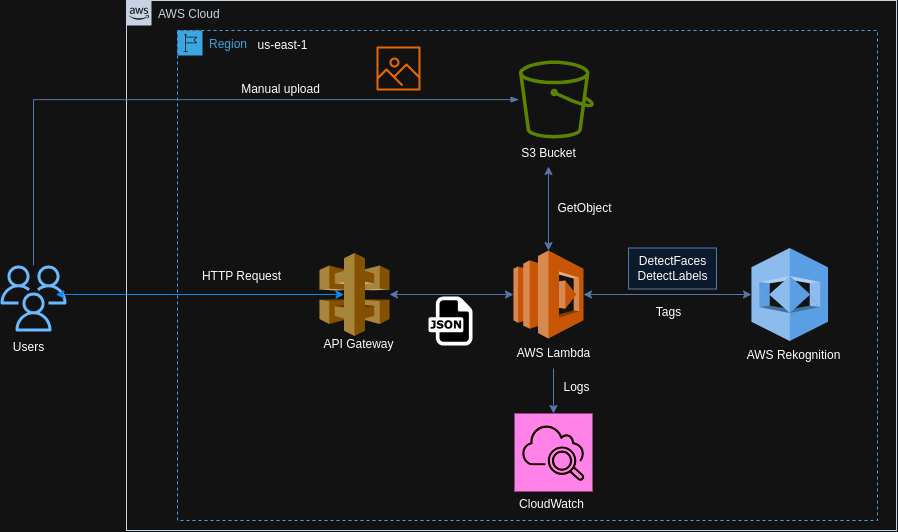

<div align="center">
  <h1>Sistema de Extração de Tags de Imagens com Lambda e Rekognition</h1>
</div>

<div align="center">
  <p>Equipe 1</p>

  | Nome                                 | Linkedin                                                                                 |
  | ---------------                      | -------------------------------------------------------------------                      |
  | Cristofer Gaier Sais                 | [Link](https://www.linkedin.com/in/cristofer-sais-a293591a0)                             |
  | João Victor Winderfeld Bussolotto    | [Link](https://www.linkedin.com/in/jo%C3%A3o-victor-winderfeld-bussolotto-aaa914145/)    |
  | Josué Mendonça                       | [Link](https://www.linkedin.com/in/josu%C3%A9-mendon%C3%A7a-dev77/)                      |    
  | Luiz Paulo Grafetti Terres           | [Link](https://www.linkedin.com/in/luiz-paulo-grafetti-terres-aa577a274/)                |      


</div>

***

<a name="ancora"></a>

## 📖 Sumário
- [1 - Objetivo](#ancora1)
  - [1.1 - Tecnologias Utilizadas](#ancora1-1)
- [2 - Desenvolvimento do Projeto](#ancora2)
  - [2.1 - Rota 1 - Get /](#ancora2-1)
  - [2.2 - Rota 2 - Get /v1](#ancora2-2)
  - [2.3 - Rota 3 - Get /v2](#ancora2-3)
  - [2.4 - Rota 4 - Post /v1/vision](#ancora2-4)
  - [2.5 - Rota 5 - Post /v2/vision](#ancora2-4)
- [3 - Acesso à Aplicação e Como Utilizá-la](#ancora3)
- [4 - Estrutura de Pastas do Projeto](#ancora4)
- [5 - Arquitetura AWS](#ancora5)
- [6 - Dificuldades conhecidas](#ancora6)
- [7 - Fonte das Imagens Utilizadas no Projeto](#ancora7)
- [8 - Licença](#ancora8)

***
<a id="ancora1"></a>
# 1 - Objetivo

O objetivo do projeto é desenvolver uma aplicação para automatizar a análise de imagens armazenadas no `S3` utilizando `AWS Lambda`, `Amazon Rekognition` e `API Gateway`. A primeira função, acessada através da rota `"/v1/vision"`, utiliza o `Amazon Rekognition` para identificar e retornar etiquetas associadas à imagem, enquanto a segunda função, acessada através da rota `"/v2/vision"`, identifica a principal emoção em cada rosto presente na imagem.

***

<a id="ancora1-1"></a>
- ## 1.1 - Tecnologias Utilizadas

  <div style="display: inline-block" align="center">
    
    
    
    
    
    
    
    

  </div>

***
<a id="ancora2"></a>

# 2 - Desenvolvimento do Projeto

O desenvolvimento do projeto envolveu a criação e configuração de funções lambdas no `AWS Lambda`, habilitando o processamento de imagens armazenadas no `Amazon S3`, construídas usando o framework `Serverless`. Utilizando o `AWS Rekognition`, as funções foram desenvolvidas com o objetivo de identificar informações relevantes nas imagens, como etiquetas descritivas e emoções predominantes nos rostos detectados. A exposição das funções por meio do `API Gateway`, com endpoints "/v1/vision" e "/v2/vision", permitiu o acesso simplificado a esses serviços via API. Além disso, o framework `Serverless` também foi utilizado para o provisionamento bucket S3 e gerenciamento das políticas de acesso do `IAM` referente às funções Lambdas.

<a id="ancora2-1"></a>

- ## [2.1 - Rota 1 - Get /](https://84ua33iq3d.execute-api.us-east-1.amazonaws.com/)
  Resposta a ser entregue:
  
  ```json
    {
      "message": "Go Serverless v3.0! Your function executed successfully!",
      "input": {
          ...(event)
        }
    }
  ```

<a id="ancora2-2"></a>

- ## [2.2 - Rota 2 - Get /v1](https://84ua33iq3d.execute-api.us-east-1.amazonaws.com/v1)
  Resposta a ser entregue:

  ```json
    {
      "message": "VISION api version 1."
    }
  ```

<a id="ancora2-3"></a>

- ## [2.3 - Rota 3 - Get /v2](https://84ua33iq3d.execute-api.us-east-1.amazonaws.com/v2)
  Resposta a ser entregue:

  ```json
    {
      "message": "VISION api version 2."
    }
  ```

<a id="ancora2-4"></a>

- ## [2.4 - Rota 4 - Post /v1/vision](https://84ua33iq3d.execute-api.us-east-1.amazonaws.com/v1/vision)
  A API "v1/vision" permite a extração de tags de imagens armazenadas no `Amazon S3`. Ao enviar uma solicitação POST com o nome do bucket e da imagem desejada, a API utiliza a função de `Detecção de Rótulos` do `Amazon Rekognition` para processar a imagem. Em resposta, a API fornece as tags extraídas, incluindo a confiança da detecção, o link da imagem e a data de criação da mesma.

  Exemplo de entrada:

  ```json
    {
      "bucket": "mycatphotos",
      "imageName": "cat.jpg"
    }
  ```

  Exemplo de retorno:

  ```json
    {
      "url_to_image": "https://mycatphotos/cat.jpg",
      "created_image": "02-02-2023 17:00:00",
      "labels": [
        {
          "Confidence": 96.59198760986328,
          "Name": "Animal"
        },
        {
          "Confidence": 96.59198760986328,
          "Name": "Cat"
        },
        {
          "Confidence": 96.59198760986328,
          "Name": "Pet"
        },
        {
          "Confidence": 96.59198760986328,
          "Name": "Siamese"
        }
      ]
    }
  ```

<a id="ancora2-5"></a>

- ## [2.5 - Rota 5 - Post /v2/vision](https://84ua33iq3d.execute-api.us-east-1.amazonaws.com/v2/vision)
  A API "v2/vision" tem como foco a detecção de rostos em imagens armazenadas no `Amazon S3`. Ao enviar uma solicitação POST com o nome do bucket e da imagem desejada, a API utiliza a função de `Análse Facial` do `Amazon Rekognition` para analisar a imagem em busca de faces. Ela retorna informações sobre os rostos detectados, incluindo a localização, idade estimada e gênero das pessoas na imagem, bem como o link da imagem e sua data de criação.

  Exemplo de entrada:

  ```json
    {
      "bucket": "myphotos",
      "imageName": "test-happy.jpg"
    }
  ```

  Exemplo de retorno:

  ```json
    {
      "url_to_image": "https://myphotos/test.jpg",
      "created_image": "02-02-2023 17:00:00",
      "faces": [
        {
        "position":
        {
          "Height": 0.06333330273628235,
          "Left": 0.1718519926071167,
          "Top": 0.7366669774055481,
          "Width": 0.11061699688434601
        },
        "classified_emotion": "HAPPY",
        "classified_emotion_confidence": 99.92965151369571686
        }
    ]
    }
  ```
  No caso de duas faces:

  ```json
    {
      "url_to_image": "https://myphotos/test.jpg",
      "created_image": "02-02-2023 17:00:00",
      "faces": [
        {
        "position":
        {
          "Height": 0.06333330273628235,
          "Left": 0.1718519926071167,
          "Top": 0.7366669774055481,
          "Width": 0.11061699688434601
        },
        "classified_emotion": "HAPPY",
        "classified_emotion_confidence": 99.92965151369571686
        },
        {
        "position":
        {
          "Height": 0.08333330273628235,
          "Left": 0.3718519926071167,
          "Top": 0.6366669774055481,
          "Width": 0.21061699688434601
        },
        "classified_emotion": "HAPPY",
        "classified_emotion_confidence": 98.92965151369571686
        }
    ]
    }
  ```
  Resposta a ser entregue quando não houver face:

  ```json
    {
      "url_to_image": "https://myphotos/test.jpg",
      "created_image": "02-02-2023 17:00:00",
      "faces": [
        {
        "position":
        {
          "Height": Null,
          "Left": Null,
          "Top": Null,
          "Width": Null
        }
        "classified_emotion": Null,
        "classified_emotion_confidence": Null
        }
    ]
    }
  ```

***

<a id="ancora3"></a>

# 3 - Acesso à Aplicação e Como Utilizá-la

## **[Link](https://84ua33iq3d.execute-api.us-east-1.amazonaws.com/)**

Para facilitar o teste das APIs do projeto, configuramos o Visual Studio Code para recomendar a instalação da extensão "Rest Client API".

<div align="center">
    
</div>

  ## Passo 1: Instale a extensão "Rest Client"

  Se você já a tem instalada, pode pular este passo. Caso não apareça a recomendação no Visual Studio Code, siga estas etapas:

  1. Vá para a aba "Extensions" (Extensões) na barra lateral esquerda.
  2. Pesquise por "Rest Client" na caixa de pesquisa.
  3. Clique em "Install" (Instalar) ao lado da extensão oferecida por "donebd".

  ## Passo 2: Abra um arquivo .http

  Agora que você tem a extensão instalada e configurada, siga estas etapas para abrir e executar um arquivo .http:

  1. Navegue até a pasta "http_requests" no seu projeto.
  2. Abra o arquivo .http correspondente à rota ou funcionalidade que deseja testar.

  ## Passo 3: Execute a solicitação HTTP

  Para executar a solicitação HTTP e testar a API, siga estas etapas:

  1. Clique no botão "Send Request" (Enviar Solicitação) no canto superior direito da solicitação no arquivo .http.
  2. Aguarde a resposta da API. Ela será exibida na parte inferior do Visual Studio Code, na guia "Output" (Saída).
  3. Você verá a resposta da API, incluindo o código de status HTTP e o corpo da resposta, na guia "Output".


<a id="ancora4"></a>

# 4 - Estrutura de Pastas do Projeto

```
.
├── assets
├── dataset
├── README.md
└── visao-computacional
    ├── controllers
    │   ├── v1Controller.py
    │   └── v2Controller.py
    ├── core
    │   └── config.py
    ├── services
    │   ├── RekognitionService.py
    │   └── S3Service.py
    ├── routes
    │   ├── v1
    |   |    ├── v1_description.py
    │   |    └── v1_vision.py
    |   ├── v2
    |   |    ├── v2_description.py
    │   |    └── v2_vision.py
    │   └── health.py
    ├── requirements.txt
    ├── serverless.yaml
    └── utils.py 

```

***

<a id="ancora5"></a>

# 5 - Arquitetura AWS

  <div align="center">
    
  </div>


***

<a id="ancora6"></a>
# 6 - Dificuldades conhecidas

1. Dificuldade de integrar os códigos de erro dos serviços da AWS.


<a id="ancora7"></a>

# 7 - Fonte das Imagens Utilizadas no Projeto

- [NVlabs/ffhq-dataset: Flickr-Faces-HQ Dataset (FFHQ) (github.com)](https://github.com/NVlabs/ffhq-dataset/tree/master)
- [The Images of Groups Dataset (cornell.edu)](http://chenlab.ece.cornell.edu/people/Andy/ImagesOfGroups.html)
- [AutoAndRoad](AutoAndRoad.com)
- [graphassets](graphassets.com)
- [redbookmarks](redbookmarks.com)
- [autotrader](autotrader.com)
- [usnews](usnews.com)

<a id="ancora8"></a>
# 8 - Licença

Este projeto está licenciado sob a Licença MIT - consulte o [Link](https://mit-license.org/) para obter mais detalhes.