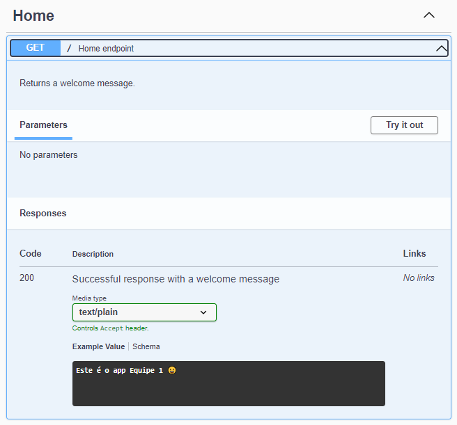
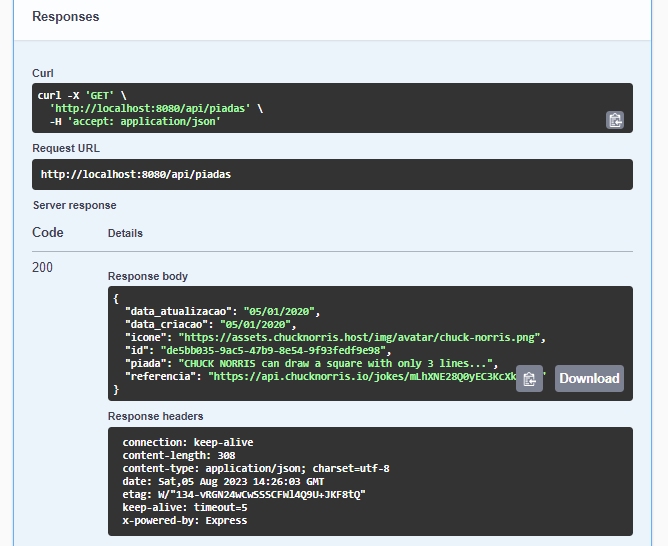
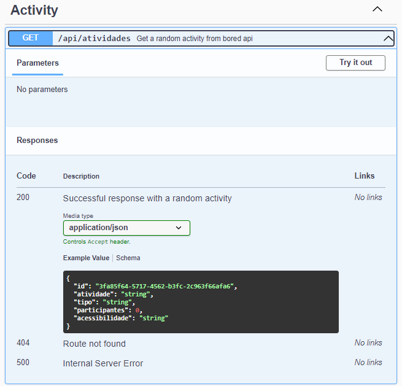

<h1 align="center"> Avaliação Sprint 4 - Equipe 1 </h1>

A aplicação terá basicamente duas rotas que irão retornar informações vindas de APIs externas  [piadas](https://api.chucknorris.io/jokes/random) e [atividade](https://www.boredapi.com/api/activity).

***

<h2 align="center"> Tecnologias </h2>

***
<p align="center">


</p>

***

<h2 align="center"> Execução (Código Fonte) </h2>

***

### Rota → Get /

1. Nesta rota será efetuado um get na raiz do projeto.

2. O retorno desta API deverá ter um texto simples.

3. Status code para sucesso da requisição será `200`

<p></p>

***
### Rota → Get /api/piadas

1. Nesta rota será efetuado um get em: [https://api.chucknorris.io/jokes/random](https://api.chucknorris.io/jokes/random)

2. O retorno da API a ser desenvolvida deverá estar na seguinte formatação:

```json
{
  "data_atualizacao": "05-01-2020",
  "data_criacao": "05-01-2020",
  "icone": "https://assets.chucknorris.host/img/avatar/chuck-norris.png",
  "id": "b7585687-b14b-406d-a557-9cfeea4a8c16",
  "piada": "CHUCK NORRIS can slit your throat with his pinkie toenail.",
  "referencia": "https://api.chucknorris.io/jokes/2itjvbXZTcScUiuAMoOPLA"
}
```
3. Status code para sucesso da requisição será `200`

<p></p>

### Endpoint

<p></p>

***

### Rota → Get /api/atividades

1. Nesta rota será efetuado um get em: [https://www.boredapi.com/api/activity](https://www.boredapi.com/api/activity)

2. O retorno da API a ser desenvolvida deverá estar na seguinte formatação:

```json
{
  "id": "b7585687-b14b-406d-a557-9cfeea4a8c16",
  "atividade": "Wash your car",
  "tipo": "busywork",
  "participantes": 1,
  "acessibilidade": "15%"
}
```
3. Status code para sucesso da requisição será `200`

<p></p>

### Endpoint

<p></p>

### Rota → Get /api-docs


1. Essa rota é para montar a documentação da API usando Swagger

<p></p>

***
<h2 align="center"> Arquitetura </h2>

***
* ```src```    
    * ``` controllers```
        * ```activityController.js```
        * ```jokesController.js``` 
    * ```docs```  
        * ```img``` 
        * ```swagger.yaml``` 
    * ```models```
        * ```Activity.js```
        * ```Joke.js```
    * ```public```
        * ```img```        
    * ```routes```
        * ```activityRoutes.js```
        * ```jokesRoutes.js```
    * ```services```
        * ```activityService.js```
        * ```jokesService.js```
    * ```utils```
        * ```helper.js```
    * ```config.js```
    * ```index.js```

***
<h2 align="center"> AWS </h2>

***

descrever deploy e colocar fluxograma aws 

***

***
<h2 align="center"> Acessar API </h2>

***

Utilizando o navegador que você mais gosta, visite o endereço: [API](http://)

***
<h2 align="center">Como alterar e atualizar o projeto na AWS</h2>

Este repositório contém o código-fonte de uma aplicação que roda na AWS usando o serviço EC2 e Docker. Para fazer alterações na aplicação e atualizá-la na nuvem, siga os passos abaixo:

1. **Faça as alterações no código**<br>
   Primeiro, faça as alterações necessárias no código da aplicação no seu ambiente local.

2. **Build da imagem Docker**<br>
   Após as alterações, você precisa fazer o build da imagem Docker da sua aplicação. Certifique-se de que o arquivo `Dockerfile` está configurado corretamente para sua aplicação.

3. **Envie a imagem Docker para o ECR**<br>
   Depois de construir a imagem Docker localmente, envie-a para o Amazon Elastic Container Registry (ECR). Este é o repositório onde a imagem da aplicação será armazenada para uso no EC2.

4. **Acesse a instância EC2 via SSH**<br>
   Após enviar a nova imagem Docker para o Amazon Elastic Container Registry (ECR), você precisará acessar sua instância EC2 via SSH para atualizá-la com a nova imagem.

5. **Rebuild da imagem Docker na instância EC2**<br>
   Uma vez conectado à instância EC2 via SSH, você deve rebuildar o Docker com a nova imagem que foi enviada para o ECR. Isso garantirá que a aplicação esteja usando a versão mais recente da imagem.

6. **Verifique a aplicação**<br>
   Após reiniciar a aplicação, verifique se as alterações foram aplicadas corretamente.

Agora sua aplicação foi atualizada na AWS com as alterações mais recentes!


***
<h2 align="center"> Dificuldades Encontradas </h2>

***
Ficamos muito tempo procurando uma solução para o problema de permissões que surgiu ao subir o Elastic Beanstalk, por padrão o Elastic Beanstalk precisa criar um autoscaling group porém nossas contas de PB não tem essa permissão. 
<p></p>

***
<h2 align="center"> Equipe </h2>

***
 
 [João Victor Winderfeld](https://github.com/joaowinderfeldbussolotto) - [John Marcel Silveira](https://github.com/JohnMarcelSilveira) -  [Paulo Sergio Nunes](https://github.com/Paulocc) 
